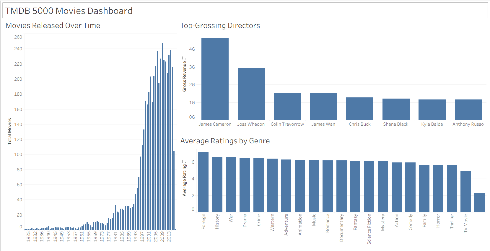

# 🎬 TMDB 5000 Movies Data Dashboard

An interactive Tableau dashboard that explores trends in the film industry using the **TMDB 5000 Movie Dataset** from Kaggle — uncovering how release patterns, audience preferences, and directorial impact have shaped the movie landscape.

[](https://public.tableau.com/app/profile/josh.pardosi/viz/Dasbor_TMDB/TMDB5000MoviesDashboard)

---

## 📊 Dashboard Preview



🔗 **[View Live Dashboard on Tableau Public](https://public.tableau.com/app/profile/josh.pardosi/viz/Dasbor_TMDB/TMDB5000MoviesDashboard)**

---

## 🎯 Project Overview

The global film industry produces thousands of movies each year, but not all genres perform equally at the box office — and critical acclaim doesn't always translate to revenue. This project analyzes **5,000 movies** to answer three strategic questions:

1. **How has movie production volume changed over time?**
2. **Which genres do audiences actually rate highest — and do those match what earns the most?**
3. **Which directors consistently generate the highest cumulative box-office revenue?**

---

## 🔍 Key Insights & Findings

### 📈 Movies Released Over Time
- Movie production saw a **dramatic surge beginning in the 1990s**, coinciding with the rise of independent cinema and digital filmmaking.
- Production volume **peaked in the mid-2000s**, likely driven by franchise expansions, sequels, and the global expansion of theatrical markets.
- The trend provides context for understanding how market saturation affects individual movie performance.

### 🎭 Average Ratings by Genre
- **Action and Adventure** films generate higher box-office revenue, but audience ratings tell a different story.
- **History, War, and Drama** genres consistently receive **higher average ratings**, suggesting audiences value storytelling depth over spectacle.
- This insight is valuable for studios balancing commercial viability with audience satisfaction and award potential.

### 🏆 Top-Grossing Directors (Top 10)
- **James Cameron** and **Joss Whedon** dominate the top of the cumulative gross revenue chart, driven by blockbuster franchises (*Avatar*, *Titanic*, *The Avengers*).
- A color gradient visualization highlights the revenue gap between the top-tier directors and the rest of the top 10.
- The concentration of revenue among a handful of directors underscores the franchise-driven nature of modern Hollywood.

---

## 🛠️ Tools & Technologies

| Tool | Purpose |
|------|---------|
| **Tableau Desktop** | Data cleaning, transformation, and dashboard development |
| **Tableau Public** | Dashboard publishing and sharing |
| **TMDB 5000 Movie Dataset (Kaggle)** | Source data — metadata for 5,000 movies |

---

## 🧹 Data Preparation

The raw dataset required significant transformation before visualization:

- **Genre Extraction:** Used Tableau's **Custom Split** function to parse genre names from nested JSON-like strings into individual, filterable genre categories.
- **Director Extraction:** Applied **REGEXP_EXTRACT** to isolate director names from the complex `crew` JSON column, enabling accurate attribution of revenue to individual directors.
- **Top N Filtering:** Implemented a **Top 10 filter** to focus the director revenue chart on the most impactful filmmakers, reducing visual noise.

---

## 📁 Repository Structure

```
TMDB-5000-Movies-Data-Dashboard/
├── dashboard.png          # Dashboard screenshot
├── README.md              # Project documentation
└── ...                    # Tableau workbook and data files
```

---

## 👤 About the Author

**Josh Peter Pardosi** — *Aspiring Data Analyst*

Computer Science undergraduate at Universitas Sumatera Utara (GPA: 3.68). Passionate about transforming raw data into actionable insights.

- **LinkedIn:** [Josh Peter Pardosi](https://www.linkedin.com/in/josh-peter-pardosi-44ab612aa/)
- **Email:** itsjoshpeter@gmail.com
